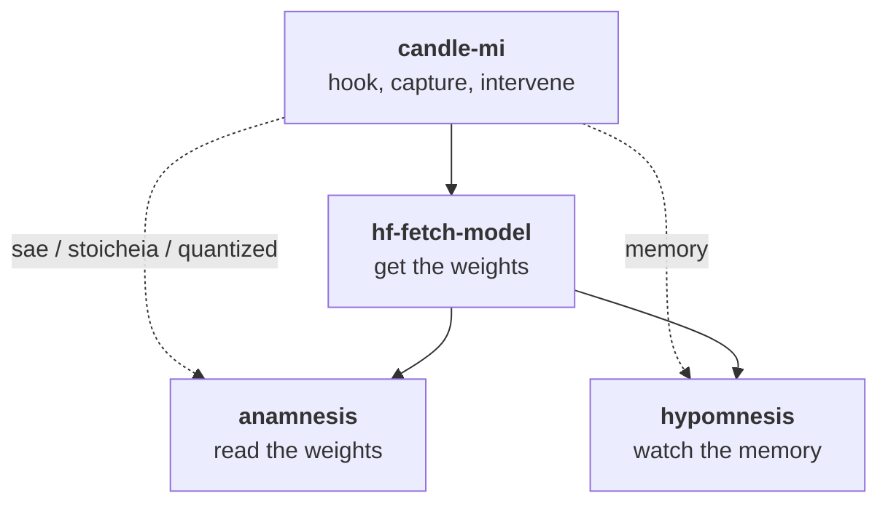

# MI for the Rust of us

**Mechanistic interpretability for language models, in Rust, on the GPU you already own.**

Mechanistic interpretability studies *how* a language model reaches its predictions: not just what it emits, but which internal components caused it. The published work in this field mostly assumes a Python stack and a datacenter GPU. This organization is a bet that it does not have to.

## The 16 GB rule

Every crate here exists because of one constraint: **a single consumer card has to be enough.** The reference machine is an RTX 5060 Ti with 16 GB of VRAM. That is not a minimum spec. It is the entire budget.

The constraint turned out to be far less limiting than the field's tooling assumes. On that one card, at F32 precision, which is what research-grade numerical parity actually requires:

- Decoder-only transformers up to roughly **7B parameters** load and run, including LLaMA 1/2/3, Mistral, Qwen 2/2.5/3, Phi-3/4, Gemma, Gemma 2 and StarCoder2. Also RWKV-6/7 linear RNNs and masked-diffusion language models, which most interpretability tooling does not reach at all.
- Anthropic's [Figure 13 rhyme-planning experiment](https://transformer-circuits.pub/2025/attribution-graphs/biology.html#dives-poem-location) runs end to end on a **524K-feature Cross-Layer Transcoder**, suppress-and-inject position sweep included, against a CLT implementation validated at **90/90 top-10 features** against the Python reference. And not once: enough model-by-transcoder cells fit on the card to show that the single-position signature reproduces while the *planning site itself does not*. That is a finding you cannot reach by replicating a figure one time.
- The logit lens over LLaMA 3.2 1B runs in about **112 ms**.

None of that needs a cluster, an H100, or a cloud budget. If you have a 16 GB card, most of what is in these repositories is reachable from your desk, and that is the whole point of the organization.

## The eco-system

Solid arrows are hard dependencies; dotted arrows are optional, behind the named feature flags.

## The crates

| Crate | | What it is |
|---|---|---|
| **[candle-mi](https://github.com/mi-for-the-rust-of-us/candle-mi)** |   | The interpretability toolkit. Transformer, RWKV, masked-diffusion and tiny-model backends re-implemented with type-safe hook points, so you can capture and intervene on activations mid-forward-pass. Built on [candle](https://github.com/huggingface/candle). 41 runnable examples. |
| **[hf-fetch-model](https://github.com/mi-for-the-rust-of-us/hf-fetch-model)** |   | Get models off the Hugging Face Hub and find out what is in them. Multi-connection parallel downloads, cache management, and remote tensor-header inspection over HTTP Range, so you can read shapes, dtypes and a GPU-fit verdict without pulling a single weight byte. CLI: `hf-fm`. |
| **[anamnesis](https://github.com/mi-for-the-rust-of-us/anamnesis)** |   | Parse any tensor format, recover any precision. Reads `.safetensors`, `.gguf`, `.npz` and PyTorch `.pth`; dequantizes FP8, GPTQ, AWQ, BitsAndBytes and all 22 GGUF block types back to bit-exact `BF16`; converts between formats. Hardened for untrusted input. CLI: `amn`. |
| **[hypomnesis](https://github.com/mi-for-the-rust-of-us/hypomnesis)** |   | External RAM and VRAM measurement for Rust processes. Process RSS plus per-process and device-wide GPU memory (Windows DXGI, NVML and PDH; Linux NVML; macOS libSystem and Metal), and WDDM spill detection that tells you when your run started paging into system RAM. CLI: `hmn`. |

## Start here

- **I want to see inside a model I can run locally.** Attention patterns, logit lens, activation patching, steering, cross-layer transcoders: [candle-mi](https://github.com/mi-for-the-rust-of-us/candle-mi), then its [examples](https://github.com/mi-for-the-rust-of-us/candle-mi/blob/main/examples/README.md).
- **I want to know whether a model will fit before I download 15 GB.** `hf-fm inspect <repo> --check-gpu`: see [hf-fetch-model](https://github.com/mi-for-the-rust-of-us/hf-fetch-model).
- **I have a quantized or awkward checkpoint and I need real tensors out of it.** `amn remember <file>`: see [anamnesis](https://github.com/mi-for-the-rust-of-us/anamnesis).
- **My training or inference run is mysteriously slow and I suspect VRAM spill.** `hmn watch <pid>`: see [hypomnesis](https://github.com/mi-for-the-rust-of-us/hypomnesis).

**Three of these four are not about interpretability at all.** anamnesis, hf-fetch-model and hypomnesis carry no MI concepts in their APIs. They exist because building an MI toolkit on consumer hardware kept running into the same three unsolved problems, and each one turned out to be worth solving on its own terms. If you write Rust against `burn`, `tch` or `candle` and have never touched interpretability, the bottom three crates are still for you.

## What the four crates share

- **MSRV 1.88**, declared on every crate and tested on every crate: each one runs a dedicated `1.88` CI lane alongside rolling `stable`, so a compiler that moves under us cannot quietly break the floor in either direction.
- **MIT OR Apache-2.0**, on every crate.
- **`unsafe` is forbidden by default.** hf-fetch-model forbids it outright. The other three allow it only in the narrow paths that genuinely need it (memory-mapped reads, and FFI to NVML, DXGI, PDH and Metal), and each states its own exemption in its README badge.
- **Pre-1.0.** The APIs may change between minor versions. Every crate keeps a `CHANGELOG.md` following [Keep a Changelog](https://keepachangelog.com/), and that changelog, not any roadmap, is the authoritative record of what shipped.
- **Dogfooding is the development method.** candle-mi is the demanding consumer that drives the other three: most of hypomnesis's releases since v0.2.4 originate in a written dogfooding report from a real candle-mi or askesis run, not from a feature wishlist.

## Roadmap

The cross-crate roadmap lives in [ROADMAP.md](https://github.com/mi-for-the-rust-of-us/.github/blob/main/ROADMAP.md): what is shipped, what is next, and the work that belongs to no single crate.

Per-crate detail stays with each crate: see its `CHANGELOG.md` for what has shipped and its own `ROADMAP.md` for what is planned.

## The names

Two of the crates are named for Plato's two kinds of memory, which is not decoration: it is what they do.

**ἀνάμνησις** (*anamnesis*), recollection, is Plato's term for recovering knowledge that was there all along. The crate takes a quantized checkpoint and recovers the precision that was compressed out of it.

**ὑπόμνησις** (*hypomnesis*), the external reminder that Socrates distrusts in the *Phaedrus*, is memory written down outside the mind. The crate measures a process's memory from outside that process.

## Development

Every crate here is developed with [Claude Code](https://claude.com/product/claude-code), with the git workflow managed in [Fork](https://fork.dev/), and follows a `CONVENTIONS.md` derived from [Amphigraphic-Strict](https://github.com/PCfVW/Amphigraphic-Strict)'s [Grit](https://github.com/PCfVW/Amphigraphic-Strict/tree/master/Grit), a deliberately strict Rust subset designed to raise AI coding accuracy.

Continuous performance benchmarking runs on [CodSpeed](https://codspeed.io/). Today that covers anamnesis, where the dequantisation hot path is the one place in the eco-system a performance regression could land without anybody noticing by eye.

Issues and pull requests are welcome on any of the four repositories.
